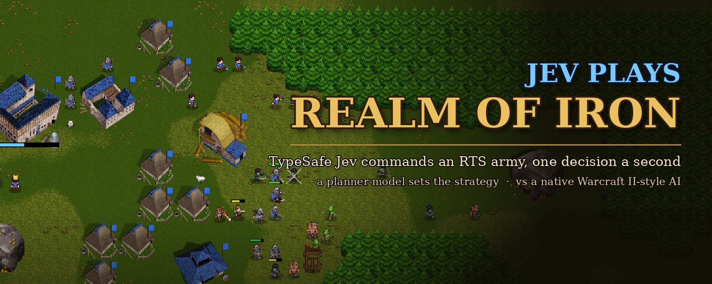
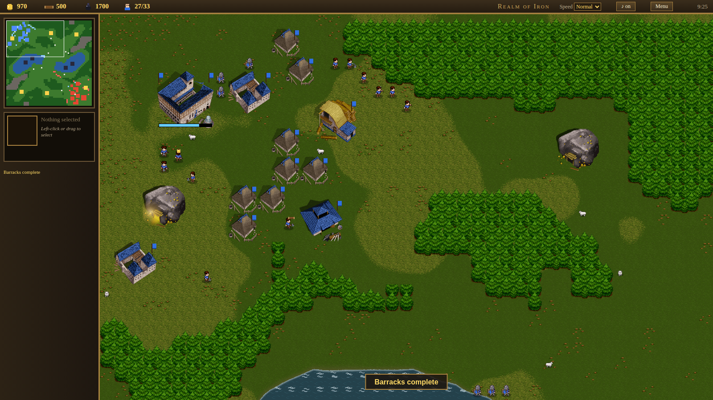

<p align="center"></p>

# Jev plays Realm of Iron

**TypeSafe Jev (`typesafe/jev-1.13`) plays a real-time strategy game.** Every game second Jev gets the legal
actions and answers with one typed decision: train, build, research, attack, defend or wait. A slower planner model
sets the strategy Jev works within. Their opponent is the game's own scripted AI. Both models are called through
[OpenRouter](https://openrouter.ai).

The project has two separate parts:

1. **The game: *Realm of Iron*.** A custom RTS written from scratch for this project in plain JavaScript, in the
   spirit of *Warcraft II: Tides of Darkness*. It is a complete game on its own: it runs in the browser with no
   build step, you can play it yourself against its scripted AI, and it knows nothing about language models.
   - humans vs orcs, three resources (gold, lumber, oil), three hall tiers, land, sea and air units;
   - spells, upgrades, fog of war, walls, cheats and deterministic replays;
   - a native AI that builds up, researches, expands, and sends mustered attack waves;
   - a small scripting API, `window.__game`, which lets outside code observe the game and give orders.
2. **The harness: `harness/llm_player.py`.** A Python program that drives the game in a browser through that API
   and lets the models play one side.
   - **Jev, the decider:** one typed choice per game second for production and one for the army, from the options
     the plan allows. This is the fast half of the agent and the point of the project.
   - **The planner:** a stronger, slower model (GPT-6 Astra by default; Claude works too) that writes a JSON plan
     every minute and on events: goals, spending, what to save for, army posture, placement and rally point.

The harness only talks to the game through `__game`, so either part can change without the other.
[How it works](#how-it-works) describes both.

All art and sound come from free-licensed packs (see [Credits](#credits-and-licences)). No Blizzard assets are used.

<p align="center"></p>

## Play it

The game is a static page, so any web server will do:

```bash
git clone https://github.com/arthurkatcher/jev-realm-of-iron.git
cd jev-realm-of-iron
python3 -m http.server 8778 --bind 127.0.0.1
# open http://127.0.0.1:8778/
```

The new-game menu sets your race, the map size (32, 64 or 96 tiles), the terrain, the starting resources, the
opponent (computer or none), fog of war and walls.

### Controls

| Input | Action |
|---|---|
| Left click / drag | Select a unit or a group |
| Ctrl+click or double-click | Select every visible unit of that type |
| Right click | Move, attack, gather, repair or board |
| Ctrl+1…9, then 1…9 | Save and recall a control group |
| Command-card hotkeys | Train, build, research or cast |
| Space | Jump to the last alert |
| + / − / Home | Zoom in, zoom out, reset the zoom |
| Enter | Type a chat line or a cheat code |
| Pause or Alt+P | Pause the game |
| F10 | Open the menu |
| F (while watching a replay) | Toggle the replay's fog |

## How it works

```
index.html ─ style.css
   │
   ├─ data.js   units, buildings, upgrades, spells, races (the numbers)
   ├─ art.js    sprites: sheet loading, team colours, animation, the procedural fallbacks
   └─ game.js   the simulation, the native AI, the renderer and UI, replays, and the agent API
                    ▲
                    │  window.__game  (Playwright)
                    │
harness/llm_player.py ── OpenRouter ── planner model (strategy, every ~60 game s)
                                    └─ decider model (one action per game second)
```

### The simulation

`game.js` runs a fixed 20 Hz tick. Everything that changes the game goes through recorded inputs: player commands,
AI decisions and the LLM harness's actions. A replay is therefore the seed plus the input list, and it plays back
identically, with periodic state hashes to catch any desync.

### The native AI

The same AI plays the computer side, and an "autopilot" can play your side too. It follows a build script, keeps its
workers balanced between gold and lumber, and builds farms ahead of need. It researches upgrades and tiers up to
Keep and Castle, and it expands when its home mine runs low. Its army goes out in mustered waves that march in hops,
so fast units don't arrive alone.

### The agent API

The browser exposes `window.__game` for tests and for the LLM harness. The main calls:

| Call | What it does |
|---|---|
| `agent({side})` | Hand a side to an external agent |
| `observe()` | A compact JSON view of the game for that side |
| `actions()` | Every action key possible now, with a label and cost |
| `macro(key)` | Carry out one action key, e.g. `train:footman` |
| `agentSet({...})` | Standing settings (see below) |
| `advance(seconds)` | Run the simulation forward |
| `replay()` / `playReplay(r)` | Export or play back a recorded game |

Action keys cover production (`train:`, `build:`, `research:`, `expand`) and army orders (`attack:base`,
`attack:nearest`, `defend`, `retreat`, `hold:choke`, `harass:workers`, `pull_wounded`, `scout:*`,
`workers:evacuate` and more). The game turns each key into ordinary unit orders using the native AI's own helpers.
The agent decides *what* happens and *when*, and the game works out *how*.

`observe()` returns a lot of state, including:
- resources and income per minute;
- army groups with their orders and ETA home;
- visible enemy groups with heading and arrival time, and the enemy's past attack waves;
- attack waves on the march;
- food supply, and failed builds;
- enemy intel kept over the whole game;
- raiders inside the base;
- our base's layout by zone.

The standing settings from `agentSet` cover:
- the share of workers on lumber;
- how many units stay home as a guard;
- where each building type goes (zones like `front`, `mine` or `back`, or a tile);
- where idle troops rally.

### The LLM player

`harness/llm_player.py` opens the game in Chromium through Playwright, hands the player's side to the agent API, and
runs two models in lockstep with the simulation. The game clock waits while the models think, so response time never
decides a fight.

1. **Planner** (default `openai/gpt-6-astra`). It is called every 60 game seconds, and also on events: a raid, a
   threat that grows, workers dying, a lost building, a new enemy unit type, a mine running dry, or an unscouted
   enemy. It reads the observation, a summary of what happened since its last plan, and the map. It answers with a
   JSON plan with these fields:
   - an `assessment` and a `strategy`;
   - `goals` (total counts to own);
   - `allowed_spending`, a `priority_action` and a `reserve_for` target;
   - an army posture with attack and retreat sizes;
   - a worker target, the lumber share and a home guard;
   - reinforcement size, building placement and a rally point.

   The plan is checked against the action catalog. A plan with bad keys is re-asked with the reason.
2. **Policy filter.** Before each decision the legal actions are narrowed by the plan: not allowed, goal reached,
   would spend the reserve, army too small, posture held, the same order given a moment ago, and so on. Urgent
   farms and emergency fighters are always offered. The masked options and their reasons are passed on too.
3. **Decider: Jev** (`typesafe/jev-1.13`, TypeSafe's typed decision model on OpenRouter's
   `/api/alpha/decisions`). It answers one typed choice per game second for production and one for
   the army. A turn with only one sensible option makes no call.
4. **Executor.** `__game.macro(key)` carries the action out. Worker balance, idle workers, emergency farms,
   repairs and the strike-back reflex run in the game itself.

Everything is logged per run in `harness/runs/<timestamp>/`:
- `log.jsonl`: plans, decisions, masks and outcomes;
- `trace.jsonl`: every API request and response, with tokens and cost;
- `replay.json` and `summary.json`;
- a snapshot of the game files, so an old run replays with the code it was played on.

The in-game **Watch replay** menu lists these runs. The replay shows the planner's plans and the decider's choices
in a chat panel next to the map.

#### Setting up OpenRouter

You need an OpenRouter API key with credit on it. Give it to the harness in either of these ways:

```bash
export OPENROUTER_API_KEY=sk-or-...          # either this
mkdir -p ~/.config/warcraft_game && printf %s 'sk-or-...' > ~/.config/warcraft_game/openrouter.key \
  && chmod 600 ~/.config/warcraft_game/openrouter.key    # or this
```

The key is never written to the logs or the run folder. For safety, set a spending limit on the key in OpenRouter,
and use the harness's `--budget` flag as well: once the budget is spent, the built-in AI takes over the side.

#### Running a game

```bash
pip install -r requirements.txt && python -m playwright install chromium
python3 -m http.server 8778 --bind 127.0.0.1 &      # the game must be served

# offline test of the whole loop, no API calls
python harness/llm_player.py --planner scripted --decider scripted --minutes 6

# a real game: watch it live in a browser window, stop at 30 minutes or $1.50
python harness/llm_player.py --seed 2 --map strait --minutes 30 --budget 1.5 --headed
```

| Flag | Meaning |
|---|---|
| `--planner MODEL` | Any OpenRouter chat model, or `scripted` / `none` |
| `--decider MODEL` | `typesafe/jev-1.13`, any chat model, or `scripted` |
| `--plan-every S` | Scheduled replan interval in game seconds (60) |
| `--budget USD` | Stop calling models after this spend |
| `--seed / --map / --size / --race` | The game to play |
| `--headed` | Show the browser and the decision chat |

Claude models work as the planner too: the harness switches to Anthropic-style prompt caching for them. A typical
plan costs $0.03–0.05 with caching, and the decider about $0.005 per game minute.

#### Where it stands

The LLM player beats the computer's first waves, but it has not yet won a full game against the native AI. The recurring weak spots are tech timing (upgrades and towers come late) and holding an army together
through a long fight. The post-mortems of each game led to the fixes in `harness/` and `game.js`. The research and
design notes are in `docs/LLM_PLAYER_RESEARCH.md` and `docs/HARNESS_ANALYSIS.md`.

## Project layout

| Path | Contents |
|---|---|
| `index.html`, `style.css` | Page, menus, HUD |
| `game.js` | Simulation, native AI, renderer, UI, replays, agent API |
| `data.js` | Unit, building, upgrade and spell data |
| `art.js` | Sprite loading, recolouring, animation |
| `assets/` | Free-licensed art and sound, with credits |
| `harness/` | The LLM player and a trace report tool |
| `docs/` | Design notes, specs, gap list, LLM research |
| `tools/` | Small generators (e.g. the synthesised sword clash) |

`docs/wiki/` holds the scripts and audit of a local reference mirror of the Warcraft Wiki. The mirrored pages
themselves are not included; `docs/wiki/fetch_pages.mjs` fetches them.

## Credits and licences

Art and sound are free-licensed third-party work, vendored in `assets/`, each under its own licence:
- sprites from the Liberated Pixel Cup (CC-BY-SA 3.0);
- Wyrmsun (CC0, one tileset CC-BY-SA 3.0) and Widelands (GPL-2.0+);
- OpenGameArt artists (CC-BY / CC0);
- sounds from the sources listed in `assets/sounds/SOURCES.md`.

Full per-file attribution is in [`assets/CREDITS.md`](assets/CREDITS.md) and the credit files next to each pack.

*Realm of Iron* is a fan project, not affiliated with or endorsed by Blizzard Entertainment. Warcraft is a
trademark of Blizzard Entertainment, Inc.
